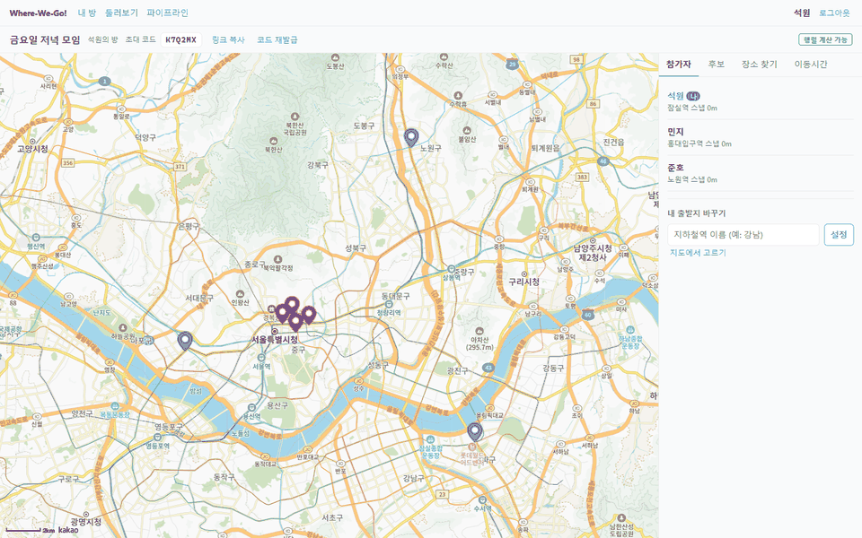
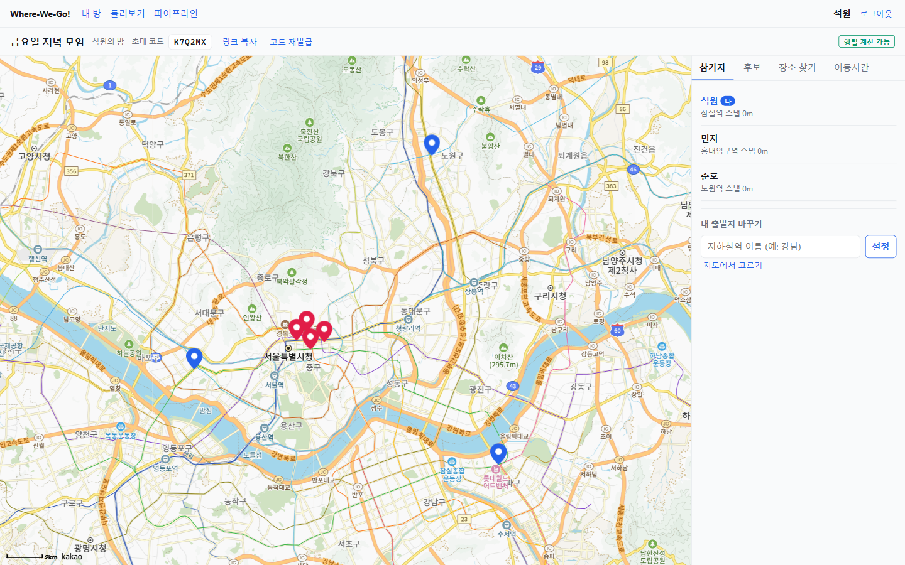
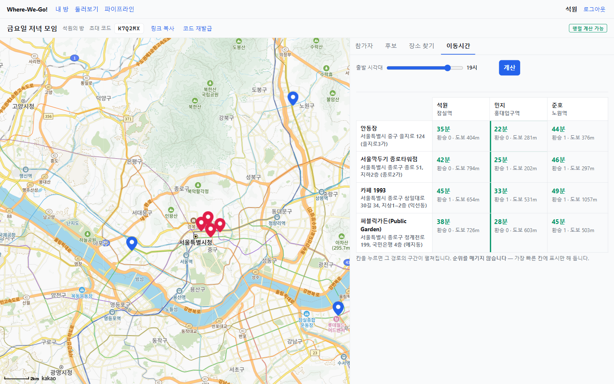
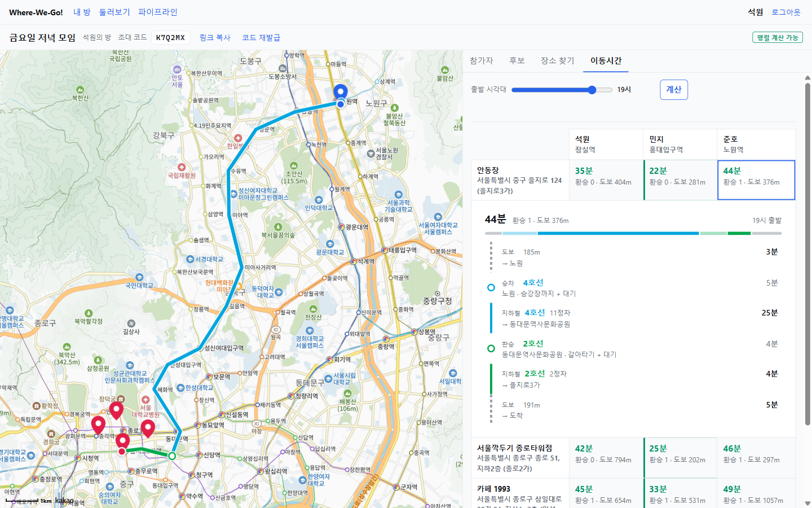
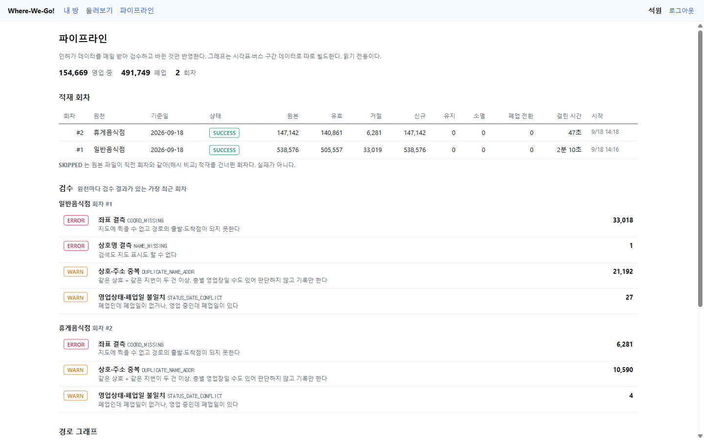

# Where-We-Go!

친구들이 방을 만들고 후보 장소를 모은 뒤, **사람 × 장소 이동시간 행렬**을 한눈에 비교하는 서비스.
그 아래에 **공간 데이터 파이프라인**이 있다 — 서울시 인허가 68만 건을 매일 받아 검수·반영하고,
지하철 시각표·버스 구간 데이터·OSM 보행망으로 대중교통 그래프를 직접 빌드해 탐색한다.

**외부 API 키 없이 클론 후 바로 실행된다.** 모든 데이터가 파일이다 — 배경지도(카카오맵)만 키가 필요하고, 키가 없으면 지도 자리에 안내가 뜨고 목록 검색은 그대로 동작한다.



| | |
|---|---|
| 인허가 적재 | 서울 일반·휴게음식점 **685,718행** → 유효 646,418 · 거절 39,300 (원천 2개 합계 2분 57초) |
| 검수 | SQL 규칙 6종 — 좌표 결측 39,299 · 상호·주소 중복 31,782 · 상태·폐업일 불일치 31 · 상호 결측 1 |
| 경로 그래프 | 노드 **213,661** · 엣지 **607,183** (보행망 484,173 · 버스 120,138 · 지하철 2,872) · 고립 노드 0 · 빌드 2분 29초 |
| 탐색 | 다익스트라 1회 **35ms** (후보가 한 동네에 모일 때) · 서울 전체 74ms |
| 행렬 API | 10명 × 20곳 중앙값 **375ms** (네트워크 제외) |
| 메모리 | 그래프 27MB · CSR 이 객체 인접리스트보다 **3.0배** 작고 1.2배 빠르다 |
| 테스트 | Python 224 · 서버 148 |

수치는 전부 잰 값이다. 측정 방법과 원자료는 [docs/perf.md](docs/perf.md), 설계와 판단 근거는 [계획서](kakaomobility-project-plan.md).

---

## 무엇을 하나

| 화면 | |
|---|---|
|  | **방** — 참가자마다 출발지(파란 핀)를 정하고, 인허가 데이터에서 찾은 가게를 후보(빨간 핀)로 담는다. 마커를 누르면 장소 카드가 뜨고 거기서 담거나 뺀다 |
|  | **이동시간 행렬** — 후보 × 사람. 출발 시각대(0~23시)를 바꾸면 버스·지하철 배차와 구간 시간이 그 시간대 값으로 바뀐다. **순위를 매기지 않는다** |
|  | **경로 상세** — 칸을 누르면 지도에 경로가 그려지고, 도보 · 승차(승강장까지 + 대기) · 주행 · 환승(갈아타기 + 대기)이 각자 한 줄로 펼쳐진다 |
|  | **파이프라인** (관리자 전용) — 적재 회차, 규칙별 검수 결과와 개별 레코드, 그래프 빌드 통계 |

> 방·로그인 화면의 스크린샷은 계정을 만들지 않고 인증 응답만 흉내 내어 찍었다. **장소·경로·행렬 숫자·파이프라인 수치는 전부 실제 데이터와 실제 탐색 결과다.**

---

## 파이프라인

```
LOCALDATA 인허가 CSV ──▶ raw ──▶ staging ──▶ 검수(SQL 6종) ──▶ serving(poi)      매일 22:00
                          │                   └▶ validation_result
                          └ 회차(ingest_run): 해시가 같으면 SKIPPED · 신규/유지/소멸/폐업전환 diff

OSM 보행망 ─┐
지하철 시각표 ─┼──▶ build_graph ──▶ graph_node / graph_edge (build_id 버저닝) ──▶ 서버 메모리(CSR)
버스 구간·배차 ─┤                                                                  └▶ one-to-many 다익스트라
환승 도보시간 ─┘
```

- **좌표계** — 인허가 원본은 EPSG:5174, 정류장·역은 4326. 전부 **5186(미터)** 으로 통일해 반경 검색과 스냅 거리를 그대로 쓴다. 원본 좌표계는 좌표를 아는 앵커 8곳 2,744건으로 판정했다(5174 중앙 오차 128m, 보정 없는 후보 335m, 음성 대조군 100km). 변환은 ETL 한 곳에서만 한다.
- **증분 갱신** — 조건부 요청 헤더(`ETag`·`Last-Modified`)에 기대지 않고 파일 SHA-256 으로 변경을 판정한다. 같으면 SKIPPED, 다르면 직전 회차와 비교해 신규·유지·소멸·폐업 전환을 센다.
- **그래프** — 역은 (역 × 노선) 플랫폼으로 복제해 환승을 엣지로 만든다. 가중치는 시간대(0~23시)별 배열이고, 운행하지 않는 시간대는 `NO_SERVICE`(-1)로 두어 탐색이 건너뛴다 — 새벽 N버스가 낮에 다니거나 새벽 4시에 지하철이 다니지 않는다.
- **탐색** — 출발지마다 한 번 퍼뜨려 후보 전부를 확정하면 멈춘다(one-to-many). 행렬의 `dijkstraRuns` 가 사람 수와 같고 후보 수와 무관하다.

## 설계에서 내린 판단

| 판단 | 이유 |
|---|---|
| **순위·추천을 하지 않는다** | "최소 합"이든 "최대 최소화"든 목적함수를 고르는 근거를 댈 수 없다. 사람들이 원하는 건 순위가 아니라 각자의 이동시간이다 |
| **모든 데이터를 파일로** | 외부 길찾기 API 에 기대면 키·승인·호출 한도가 생기고, 심사자가 직접 돌려 볼 수 없다 |
| **그래프를 배열(CSR)로** | 노드 21만 · 엣지 61만. 같은 탐색을 `List<List<Edge>>` 로 돌린 대조군보다 탐색 구조가 엣지당 16B 대 49B, 3.0배 작다 |
| **모르는 값을 지어내지 않는다** | 배차를 모르는 버스 노선에 "5분"을 넣으면 하루 한 대 다니는 새벽 노선이 5분마다 오는 노선이 된다. 폴백을 없애고 그 노선을 뺐다 |
| **관리자 화면을 관리자 전용으로** | 검수 결과에 업소의 인허가번호·주소가 판정 사유와 함께 나온다. 관리자는 환경변수 `WWG_ADMIN_LOGIN_IDS` 로 정한다 |

## 데이터의 한계

숨기지 않는다. 결과를 읽을 때 알아야 하는 것들이다.

- **9호선 환승 도보시간은 추정치다.** 측정 파일이 9호선 1단계를 전부 10:00 자리값으로 두었다. 거리 기반 값에 1~8호선 90쌍에서 유도한 보정(+88초)을 더한다. 교차검증 오차 중앙값 28초, 그 오차 범위(±80초)로 흔들어도 역→역 경로의 97% 이상이 그대로다.
- **급행↔완행 전환 도보 30초는 잰 값이 아니다.** 0초보다 크고 승강장↔대합실 편도보다 작아야 한다는 경계 안에서 골랐다.
- **승강장↔대합실 시간은 환승값에서 유도한 값이다**(역 환승 도보 중앙값 ÷ 2, 모자란 승강장만 올림).
- **지하철 배차는 (역, 방향, 시간대) 단위다.** 1호선·5호선처럼 갈라지는 노선에서는 목적지에 따라 실제 대기가 더 길 수 있다.
- **시각표는 계획 운행시각이다.** 지연·감축 운행은 반영되지 않는다. 시간대는 **출발 시각으로 고정**하고, 가는 동안 시간이 흐르는 것은 반영하지 않는다.
- **1~9호선 기준이다.** 신분당선·경의중앙선·공항철도 등 시각표에 없는 노선은 빠진다. 경기·인천·광역 버스는 서울시 정류장마스터에 좌표가 없어 뺐다.
- **영업상태 변경 이력이 없다.** `poi` 는 현재 상태와 폐업일만 든다. 원본의 영업상태 반영 지연도 그대로 따라간다.
- **일일 적재는 노트북의 예약 작업이다.** 절전(Modern Standby) 중에는 깨어나지 않아 22:00 로 옮겼다. 켜 두지 않은 날은 회차가 비고, 다음 실행에서 해시로 이어진다.

---

## 실행

```bash
docker compose up -d db
docker compose --profile migrate run --rm flyway   # 스키마 (Flyway V1~V11)
docker compose up -d                               # 서버까지 → http://localhost:8080
```

데이터를 넣으려면 원본 CSV 가 필요하다. `csv/` 는 저장소에 없다 — 340MB 이고 단일 파일이
GitHub 한도(100MB)를 넘는다. 출처와 배치는 [etl/README.md](etl/README.md) 를 본다.

```bash
py -m venv .venv
./.venv/Scripts/python.exe -m pip install -r etl/requirements.txt
./.venv/Scripts/python.exe -X utf8 -m etl.ingest --source all      # 인허가 적재 + 검수
./.venv/Scripts/python.exe -X utf8 -m etl.build_graph              # 경로 그래프 (약 2분 반)
```

### 설정 (`.env`, 저장소 루트)

| 키 | |
|---|---|
| `WWG_KAKAO_JS_KEY` | 배경지도. 카카오 개발자 콘솔 **플랫폼 > Web** 에 `http://localhost:8080`(개발 중엔 `:5173` 도)을 등록해야 지도가 뜬다 |
| `WWG_ADMIN_LOGIN_IDS` | 파이프라인 화면을 볼 아이디, 쉼표로 구분 |

Docker Compose 가 루트 `.env` 를 읽고, `gradlew bootRun` 도 `build.gradle` 이 같은 파일을 넘긴다. Spring Boot 자체는 `.env` 를 읽지 않으므로 `server/.env` 에 두면 동작하지 않는다.

### 개발 · 테스트

```bash
cd server && ./gradlew bootRun      # 서버 (JDK 25)
cd web && npm run dev               # 프론트 HMR — :5173 에서 /api 를 8080 으로 프록시
cd server && ./gradlew test         # 서버 테스트 (DB 가 떠 있으면 실제 그래프 검증까지)
cd server && ./gradlew perfTest     # 성능 측정 → build/reports/perf/perf.md
./.venv/Scripts/python.exe -m pytest etl/tests
```

## API

| | | |
|---|---|---|
| `GET /api/v1/places/nearby` · `/search` · `/{poiId}` | 반경 검색(`ST_DWithin` + GiST) · 상호명(pg_trgm) · 상세(출처·회차·검수 기록) | 공개 |
| `GET /api/v1/routes` | 단건 경로 — 좌표나 역 이름, 시간대 | 공개 |
| `POST /api/v1/auth/signup` · `/login` · `/logout` | 세션 로그인 + CSRF | |
| `/api/v1/rooms/**` | 방 · 참가 · 출발지 · 후보 | 참가자 |
| `POST /api/v1/rooms/{id}/matrix` | 이동시간 행렬 (동기, `stats` 포함) | 참가자 |
| `GET /api/v1/rooms/{id}/routes` | 행렬 칸의 경로 상세 — 구간 + 지도용 좌표열 | 참가자 |
| `GET /api/v1/admin/*` | 적재 회차 · 검수 집계/레코드 · 그래프 통계 | 관리자 |

전체 명세는 계획서 §4.

## 스택

PostgreSQL 17 + PostGIS 3.5 · Flyway · Python (pandas · pyproj · OSMnx) · Spring Boot 4 + JDK 25 (JdbcTemplate, JPA 없음) · Vite + 바닐라 JS · 카카오맵 JS SDK
